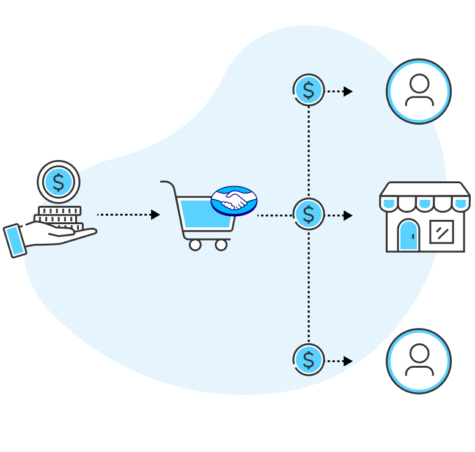

# Integración de Mercado Pago

## Split de pagos

La solución de [Split de pagos](https://www.mercadopago.com.ar/developers/es/docs/split-payments/landing) está diseñada para proporcionar servicios de Proveedor de Servicios de Pago (PSP) a vendedores en modelos de marketplace. Los marketplaces son plataformas de comercio electrónico que conectan vendedores y compradores, ofreciendo un entorno unificado para ventas en línea, ampliando el alcance y la conversión.

<p align="center" width="100%">
    
</p>

Caso de uso: Tenemos una aplicación de ventas de entradas (tickets) para el cine, los cines pueden vender sus entradas en este marketplace y éste les cobrará una comisión por cada venta. Siguiendo la imagen, el cine recibe el cobro de la entrada y se realiza un split (división) del pago en 3 partes (el cine, el marketplace y mercadopago).

Usaremos tres cuentas de prueba:

- Marketplace (Creador de la integración).
- Vendedor(es) cine.
- Cliente(s).

Con la cuenta de prueba que nombraremos "Marketplace" creamos una integración y copiamos las credenciales de <b>prueba</b> en el archivo `.env`:

```env
MERCADOPAGO_ACCESS_TOKEN=[Access Token]
NEXT_PUBLIC_MERCADOPAGO_PUBLIC_KEY=[Public Key]
MERCADOPAGO_WEBHOOK_SECRET=[Clave secreta]

NEXT_PUBLIC_APP_URL=[CloudflareURL]
```

En la sección Webhooks colocamos la [CloudflareURL] y copiamos la clave secreta en `MERCADOPAGO_WEBHOOK_SECRET`.

Para obtener la CloudflareURL, vamos a [Quick Tunnels de Cloudflare](https://developers.cloudflare.com/cloudflare-one/connections/connect-networks/do-more-with-tunnels/trycloudflare/) y seguimos las instrucciones, básicamente son:
Para windows, ejecutar el comando:

```bash
winget install --id Cloudflare.cloudflared
```

Crear un nuevo tunel con el comando:

```bash
cloudflared tunnel --url http://localhost:3000
```

pegar la url generada en `NEXT_PUBLIC_APP_URL` del archivo `.env`, en la sección Webhooks con el sufijo /api/oauth/token (ej: https://judges-bi-allowance-phone.trycloudflare.com/api/oauth/token) y en URLs de redireccionamiento de la configuración avanzada de las integración creada con la cuenta de prueba para el marketplace.

Ahora solicitaremos a los vendedores la autorización de cobro en nombre del marketplace, para ello solicitamos hacer clic en el siguiente enlace:

```html
https://auth.mercadopago.com.ar/authorization?client_id=APP_ID&response_type=code&platform_id=mp&redirect_uri=REDIRECT_URI
```

Y reemplazamos los valores `APP_ID` y `REDIRECT_URI` por el Número de aplicación (Ej: 1647545615454062) y la [CloudflareURL].

Esto nos devolverá un `access_token` y un `refresh_token`, con el primero crearemos una preferencia de pago para el vendedor cuyo cobro nos acaba de autorizar.

## Creación de preferencia para el vendedor

```js
import { MercadoPagoConfig, Preference } from "mercadopago"; // SDK de Mercado Pago

const client = new MercadoPagoConfig({
  accessToken: access_token,
});

const preference = await new Preference(client).create({
  body: {
    items: [
      {
        id: "1234",
        title: "Mi producto",
        quantity: 1,
        currency_id: "ARS",
        unit_price: 10,
      },
    ],
    back_urls: {
      success: `${process.env.NEXT_PUBLIC_APP_URL}/api/webhooks/mercadopago/notifications`,
      failure: `${process.env.NEXT_PUBLIC_APP_URL}/api/webhooks/mercadopago/notifications`,
    },
    auto_return: "approved",
    binary_mode: true, // aprobados o rechazados.
    marketplace_fee: 1,
    marketplace: "MP-MKT-[Client Id]",
  },
});
```

Comprador (Cliente)
TESTUSER577618184
xB9td0HrGu

Argentina
Vendedor (organizer)
TESTUSER1875390523
01ewf3OumA

Argentina
Marketplace (flokoob)
TESTUSER711650740
yEcVD7JS7A
